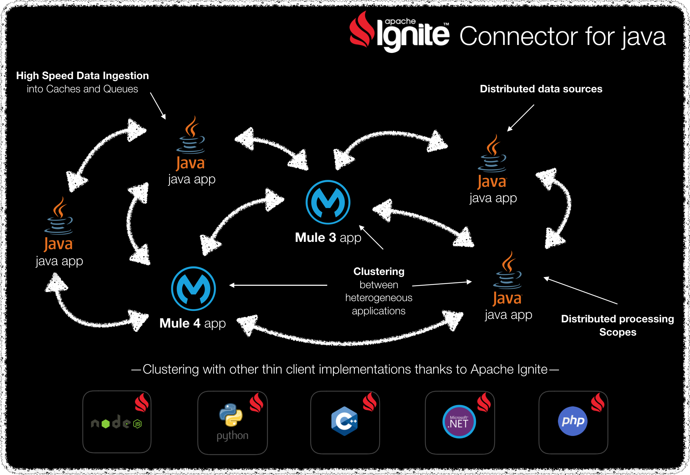

# Hawkore's stand-alone connector for Apache Ignite

_[Apache Ignite(TM)](https://ignite.apache.org) is a memory-centric distributed database, caching, and processing platform for
transactional, analytical, and streaming workloads, delivering in-memory speeds at petabyte scale._

*All company names, logos, brand names and trademarks are property of their respective owners. All company, product and service names used in this website are for identification purposes only.*

## Requirements

	-  Java >= 1.8.0_65 (OpenJDK and Sun have been tested)
	-  Maven >= 3.3.0

## Clone

	-  Clone this project: `git clone http://github.com/hawkore/examples-apache-ignite-connector-stand-alone.git`
	-  Change to directory: `cd examples-apache-ignite-connector-stand-alone`

## Content

* `ignite-server-node-test`: Server nodes to test Hawkore's Apache Ignite connector stand-alone. See [README.md](ignite-server-node-test/README.md) for more info.

* `examples-apache-ignite-connector-client`: Contains sample source code for [Hawkore's Apache Ignite connector stand-alone
](https://docs.hawkore.com/private/apache-ignite-connector-standalone/) documentation. See [README.md](examples-apache-ignite-connector-client/README.md) for more info.

# Other resources

Sign up at [www.hawkore.com](https://www.hawkore.com) to access full documentation.
